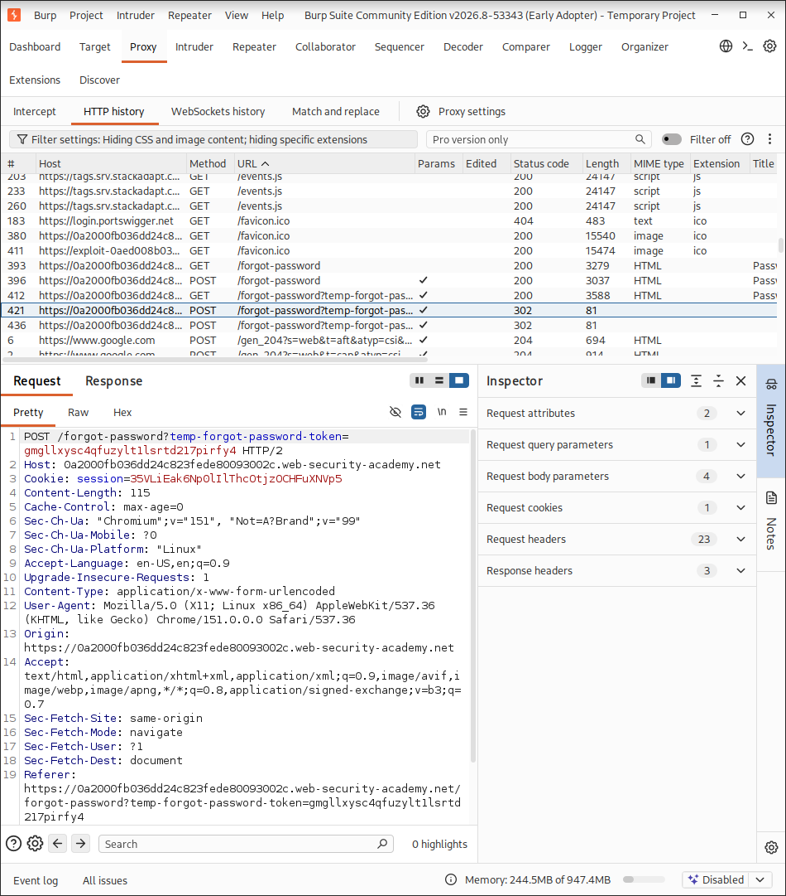
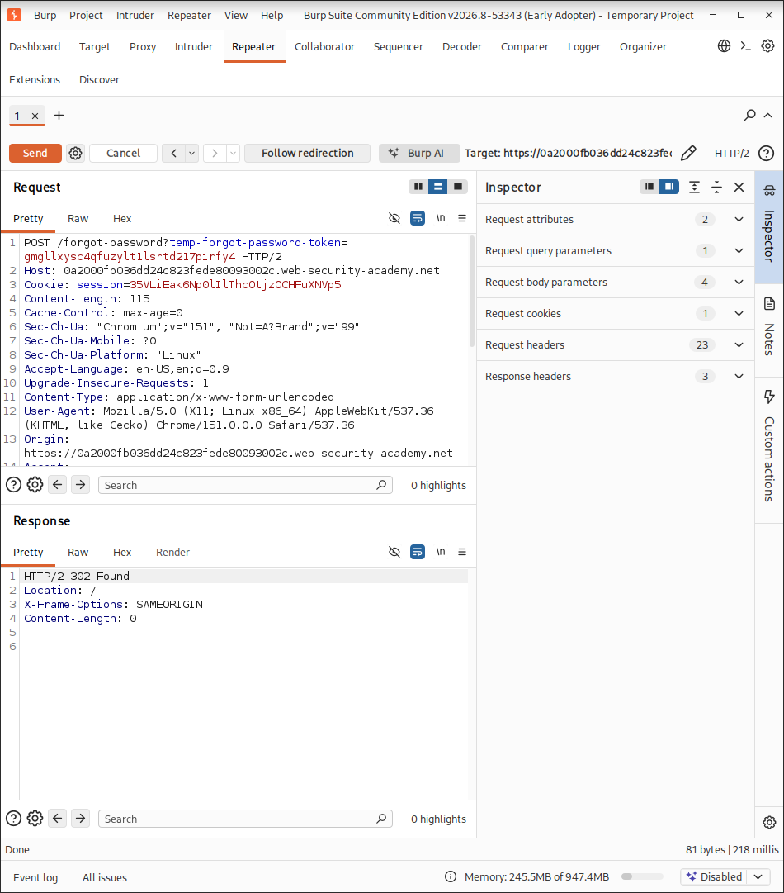
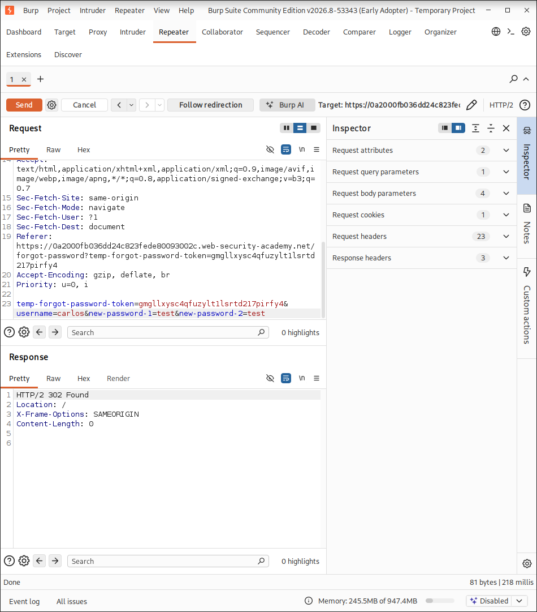
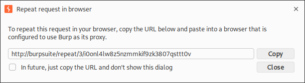
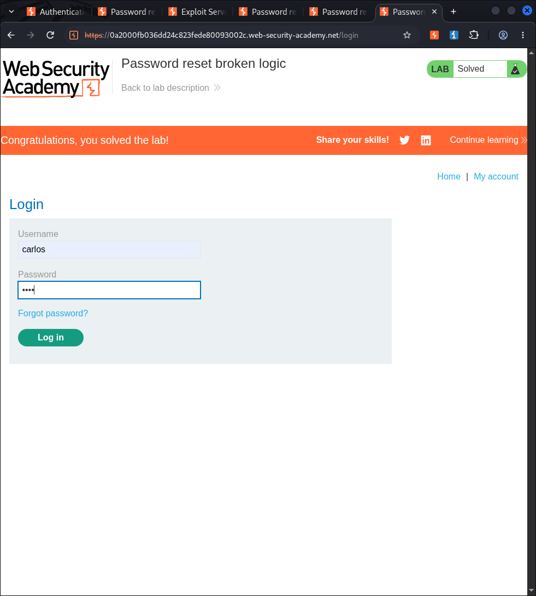

# Lab: Password Reset Broken Logic

This repository documents the walkthrough and proof of concept (PoC) for PortSwigger's **Password reset broken logic** lab.

---

## Vulnerability Overview

The target application contains a business logic vulnerability within its password reset functionality. Specifically, when a user submits a password reset request via `POST /forgot-password`, the application fails to verify whether the submitted `temp-forgot-password-token` parameter matches the target user account or if the parameter is populated at all. 

As a result, an attacker can modify the `username` field in the request body to reset any arbitrary user's password without providing a valid reset token.

---

## Step-by-Step Walkthrough

### Step 1: Capture Password Reset Traffic

1. With Burp Suite running, click the **Forgot your password?** link on the login page and enter your own username.
2. Click **Email client** to view the reset email. Click the provided link and reset your password.
3. In Burp Suite, open **Proxy > HTTP history** to examine the HTTP traffic.
4. Locate the `POST /forgot-password?temp-forgot-password-token=...` request and send it to **Burp Repeater**.

---

### Step 2: Verify Token Validation Logic

1. Open **Burp Repeater** and examine the parameter structure of the captured request. Note that `temp-forgot-password-token` appears in both the URL query string and the request body.
2. Delete the value of the `temp-forgot-password-token` parameter in both locations (URL and body).
3. Click **Send**. The application returns a `302 Found` response, confirming that the backend does not validate the presence or validity of the token during password submission.

---

### Step 3: Manipulate Target Account Parameters

1. Return to the browser, request a new password reset link for your account, and capture the new `POST /forgot-password` request in Repeater.
2. Delete the token values from both the URL query parameter and the request body parameter.
3. Change the `username` parameter value to the target account: `carlos`.
4. Set `new-password-1` and `new-password-2` to your desired new password (e.g., `test`).
5. Send the request to update the target account's credentials.

---

### Step 4: Verify Browser Session

1. Right-click the request in Repeater and select **Copy URL in browser** / **Repeat request in browser** (or navigate using a proxy-configured browser window) to verify the request state.

---

### Step 5: Log In and Complete the Lab

1. Navigate to the application login page in the browser.
2. Log in using the username `carlos` and the new password set in Step 3 (`test`).
3. Click **My account** to confirm successful account takeover and solve the lab.

